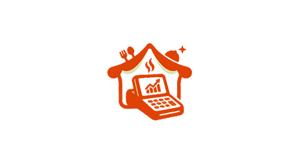
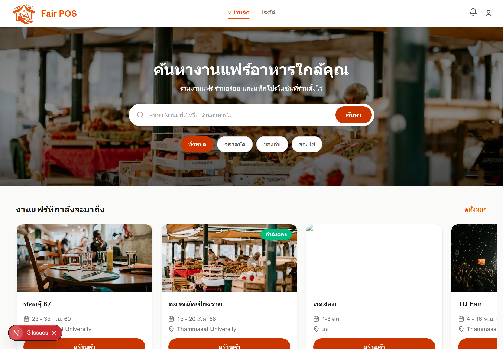
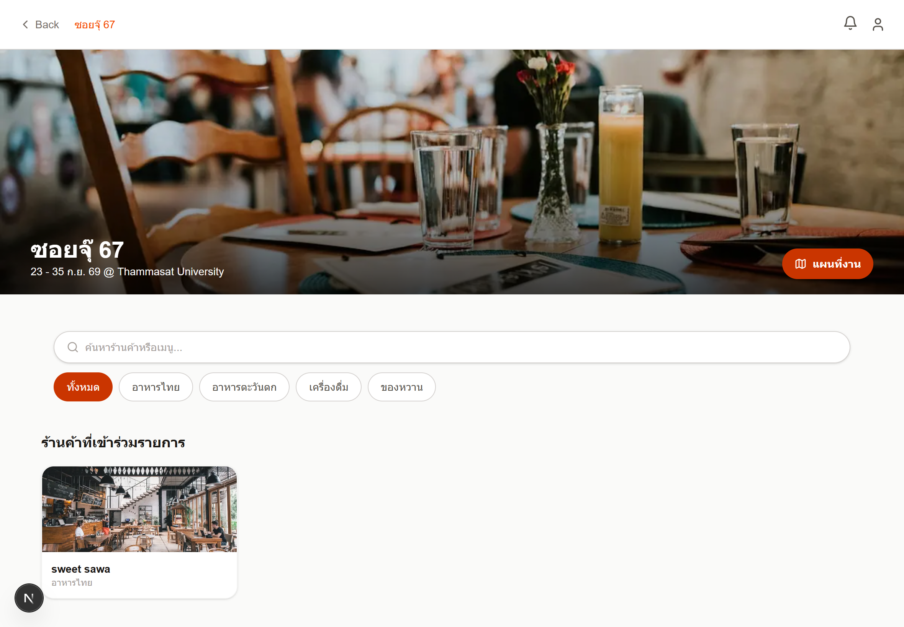
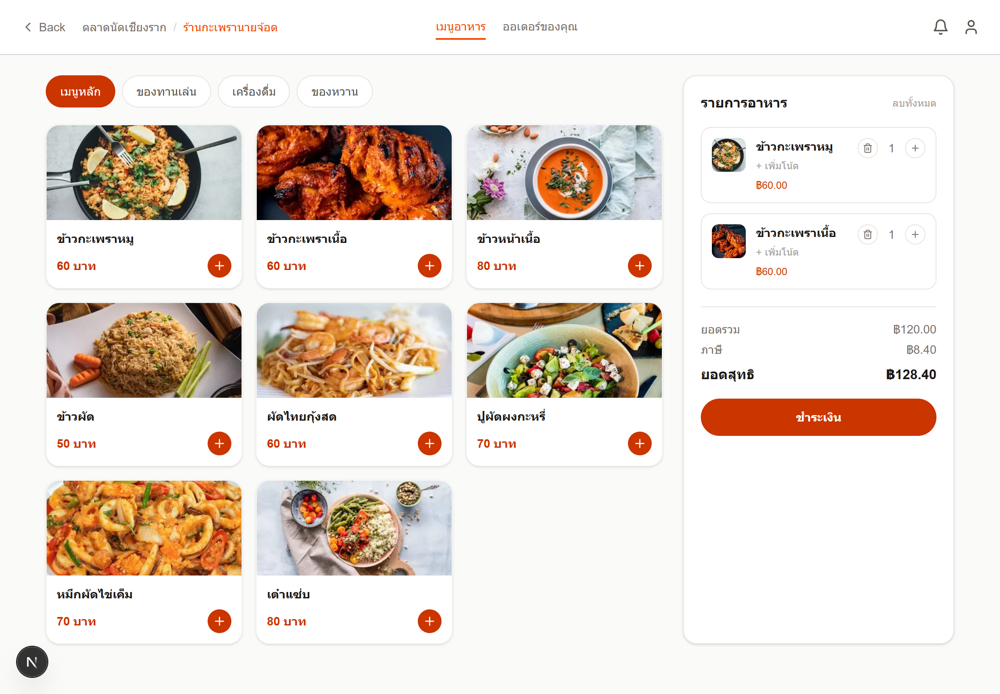
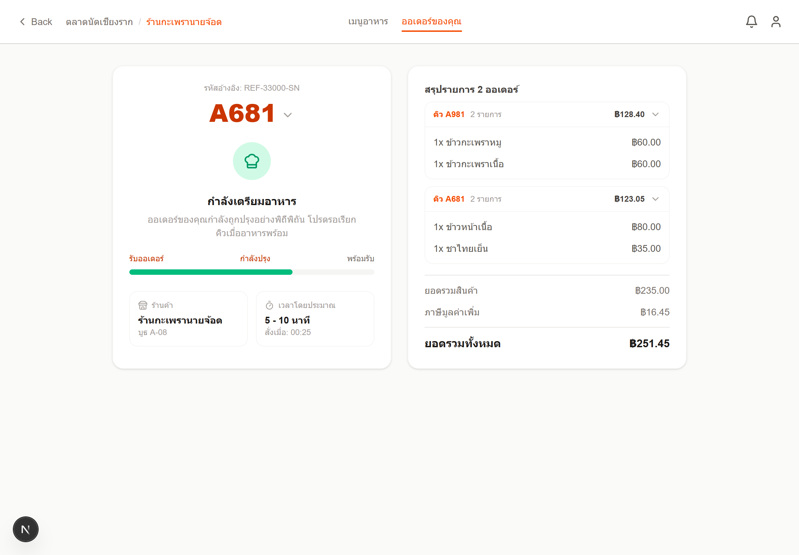
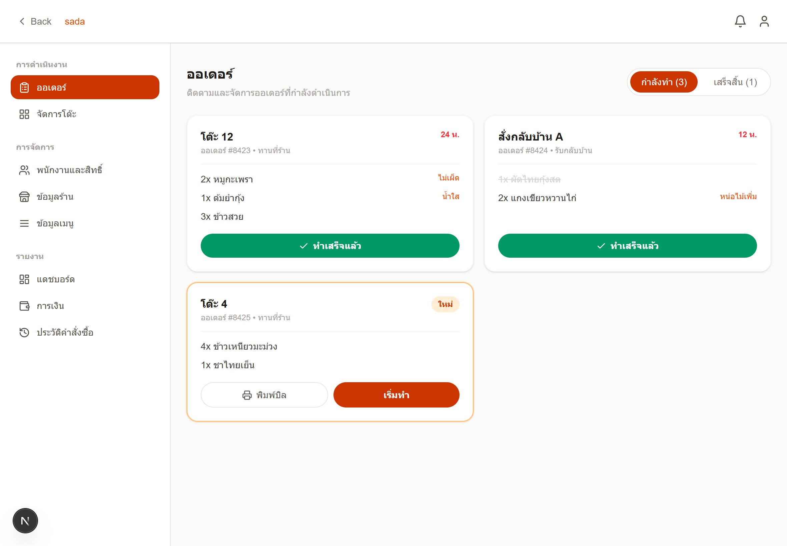
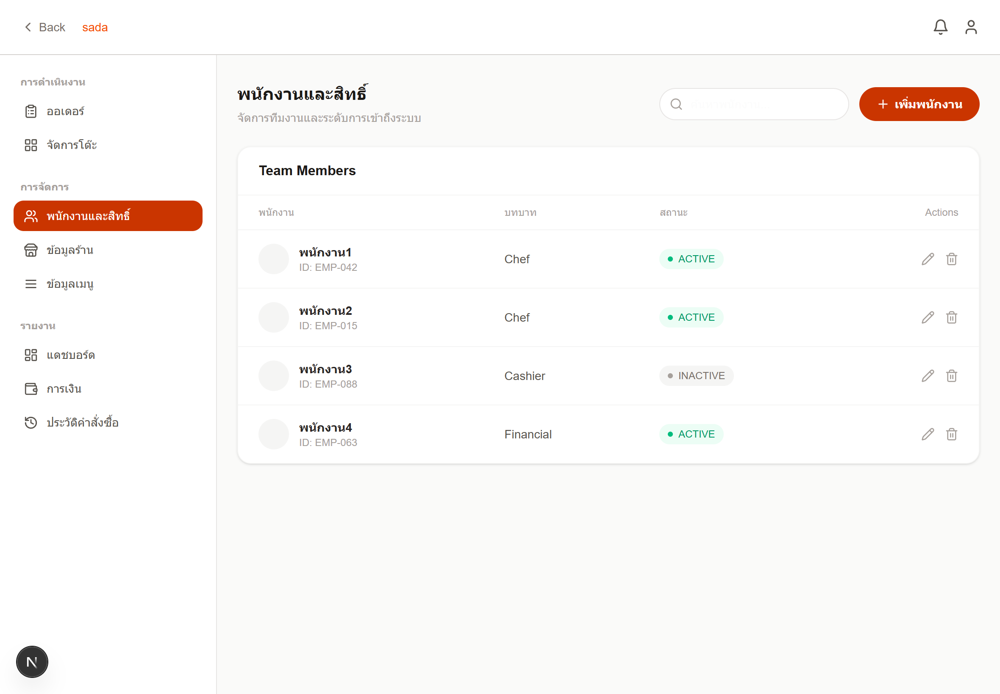
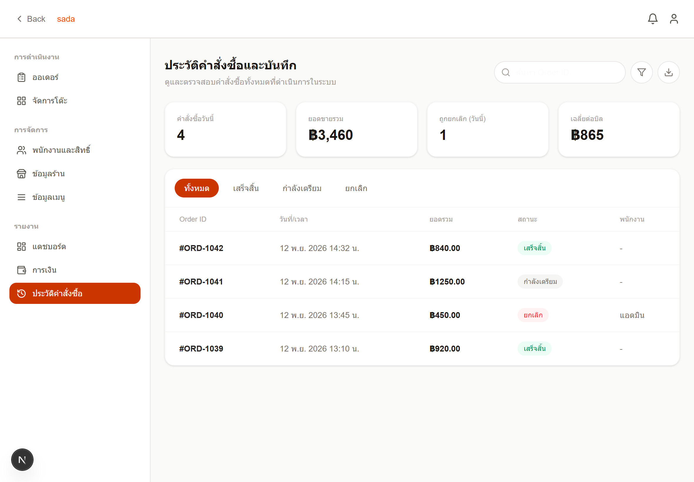
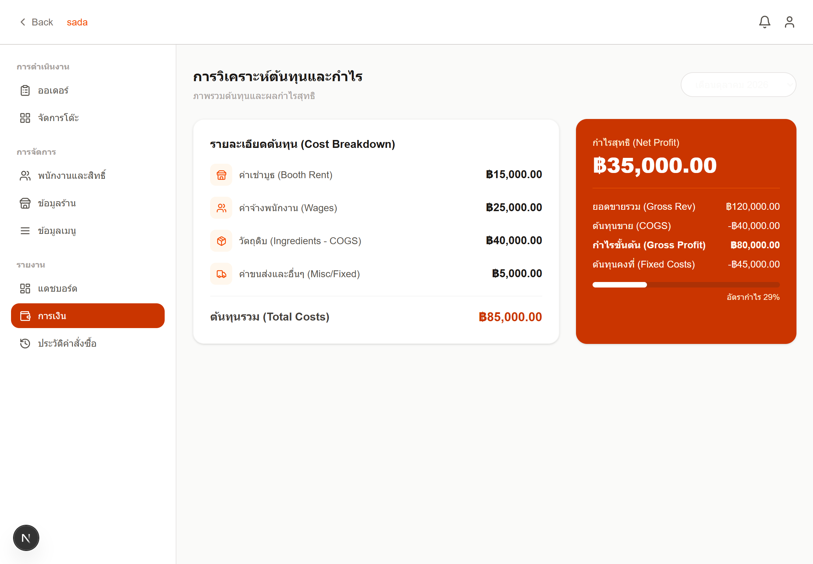

# 🍽️ FairPOS

  

  
  
  

## ✨ Overview

**FairPOS** is a web-based Point of Sale system designed for **school fairs, university events, food festivals, and small temporary restaurants**.

Running a food booth during an event can get chaotic — orders pile up, the kitchen gets confused, and keeping track of sales can become difficult.

FairPOS brings the **front counter, kitchen, menu, orders, and sales** into one simple system, helping first-time event operators serve customers faster and stay organized.

## 🚀 Features

| Feature              | Description                                                    |
| -------------------- | -------------------------------------------------------------- |
| **Point of Sale**    | Create and manage customer orders quickly at the counter.      |
| **Menu Management**  | Manage menu items, categories, prices, and availability.       |
| **Kitchen Display**  | Give the kitchen a clear view of pending and completed orders. |
| **Order Management** | Track order status from creation to completion.                |
| **Table Management** | Manage tables and assign dine-in orders.                       |
| **Shop Management**  | Configure your restaurant or event booth in one place.         |
| **Sales Overview**   | Keep track of orders and basic sales information.              |

## 🎯 Built For

FairPOS is designed for:

* 🏫 University and school fairs
* 🍔 Temporary food booths
* 🎪 Festivals and events
* 🍜 Small restaurants
* 👨‍🍳 First-time food business operators
* 👥 Student event teams

## 🖥 Built With

<table>
<tr align="center">
  <td width="100">
    
  </td>
  <td width="100">
    
  </td>
  <td width="100">
    
  </td>
</tr>
<tr align="center">
  <td>Next.js</td>
  <td>Tailwind</td>
  <td>Firebase</td>
</tr>
</table>

## 📸 Screenshots

<table>
<tr>
<td align="center">
  
   <b>Searching For Fair</b>
</td>
<td align="center">
  
   <b>Searching For Restaurant</b>
</td>
</tr>
<tr>
<td align="center">
  
   <b>Take & Submit Order</b>
</td>
<td align="center">
  
   <b>Manage & Split Bill</b>
</td>
</tr>
<tr>
<td align="center">
  
   <b>Real-time Kitchen Display Queue</b>
</td>
<td align="center">
  
   <b>Store & Employee Role Management</b>
</td>
</tr>
<tr>
<td align="center">
  
   <b>Cost Analysis</b>
</td>
<td align="center">
  
   <b>Financial Management</b>
</td>
</tr>
</table>
